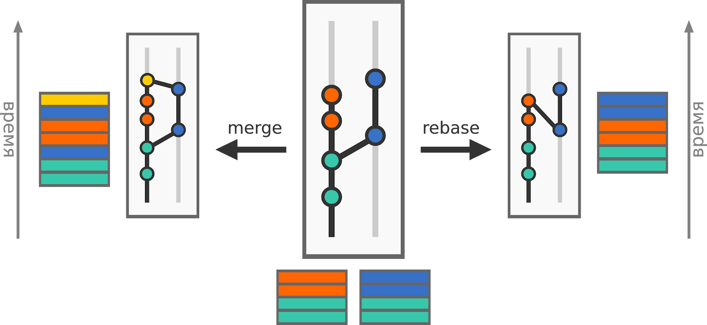

< [__Содержание__](./readme.md)

## Ветвление

При ведении разработки нередко приходится вести процесс разработки определенного функционала отдельно от основного проекта.

Создание различных версий репозиториев, отличных друг от друга и называется ветвлением.
### Создание ветки и переключение на ветку

* git branch [наименование] — команда, которая создает новую ветку в репозитории.

* git checkout [наименование] — команда, которая переключает вас на определенную ветку.

* Можно совместить выполнение этих команд:

* git checkout -b [наименование] — создаёт новую ветку и переключает вас на неё.
### Объединение ветвей

* git merge [наименование] — поглощение. Вносит коммиты из другой ветки в текущую.

* git rebase[наименование] — перебазирование. В этом случае коммиты вашей ветки накладываются поверх текущего состояния указанной ветки.

Как видно, смысл команд одинаковый — слить две ветви воедино, а механизм различается. Какой вариант лучше — вопрос из разряда «святых войн». У каждого варианта свои достоинства, поэтому рекомендуем их комбинировать — использовать в зависимости от ситуации. Какой именно механизм использовать и в каком случае — обычно решается на уровне команды.

Более распространён вариант с использованием merge, так как он более очевиден, поэтому рекомендуем изначально использовать именно его.

Scheme https://skillfactory.ru/